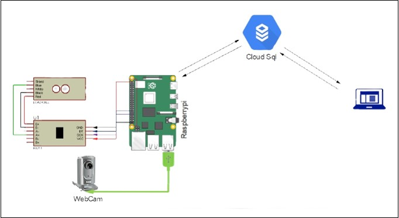
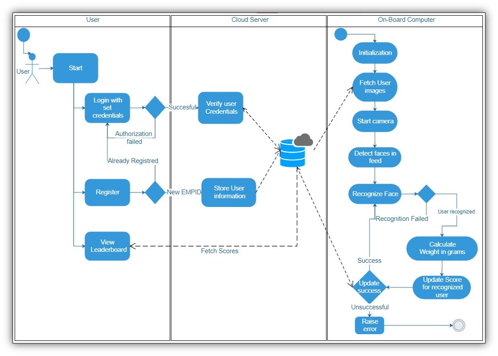

# Incentivized_TechBin

Incentivized Tech-Bin

This project was prepared as a PBL(Project Based Learning) Subject of SPPU S.E Computer Technology.

#### Demo at : [TechBin Demo](http://techbin.ml/)


### Problem Statement: 

A point based Incentivized Tech Bin will have the facility to generate rewards for the bin users based on the frequency of the user using the bin. Design a system where the user is scored with the points each time garbage is put into the bin indicating the amount of garbage. Design a gamified portal to provide rewards motivating users to throw more and more garbage.

### Architecture:



### Swimlane Diagram:



### Working:

#### The Thing :
  (TechBin) is equipped with camera and weight sensors. As soon as user registers on Portal _The Thing_ Fetches your face pattern from the server and stores locally. Whenever the user walks in front of bin to dump the trash _Thing_ recognize face and matching updates the score according to the amount of trash dumped into the bin.

#### The Portal:
  (techbin.ml) shows the leaderboard of all the users of certain organization or city the bin is configured for and shows near real-time leaderboards. The portal also allows for Login and registration. Once registered user if eligible for Participating. And Login allows user to claim whatever the rewards are awarded (if any) to them.

### How to Install : 

```

git clone https://github.com/swapnillondhe24/Incentivized_TechBin

```

* For Portal:

    1. In [config.php](https://github.com/swapnillondhe24/Incentivized_TechBin/blob/main/Portal/config.php) edit your server details.

* For Thing:

    1. Edit SQL server configurations in [Thing_Code.py](https://github.com/swapnillondhe24/Incentivized_TechBin/blob/main/Thing/Thing_Code.py)
    2. Set up Thing as per Circuit diagram [Reference](https://tutorials-raspberrypi.com/digital-raspberry-pi-scale-weight-sensor-hx711/)
        1. Connect load cell to HX711 as :
            1. Green/ Blue --- A-
            2. White --- A+
            3. Black --- E-
            4. Red --- E+
        2. Connect HX711 to Raspberry pi as :
            1. VCC --- Raspberry Pi (5V)
            2. GND --- Raspberry Pi (GND)
            3. DT --- Raspberry Pi (GPIO 5)
            4. SCK --- Raspberry Pi (GPIO 6)
        3. Connect camera to raspberry Pi using CSI or USB and give appropriate index for video capture in Thing\_Code.py

>Calibrate the HX711 [Reference Here](https://github.com/tatobari/hx711py) and update referenceValue in code

>Host Portal

>Register users.

>Done.

Special Thanks to :

1. [https://tutorials-raspberrypi.com/digital-raspberry-pi-scale-weight-sensor-hx711/](https://tutorials-raspberrypi.com/digital-raspberry-pi-scale-weight-sensor-hx711/)
2. [https://github.com/tatobari/hx711py](https://github.com/tatobari/hx711py)
